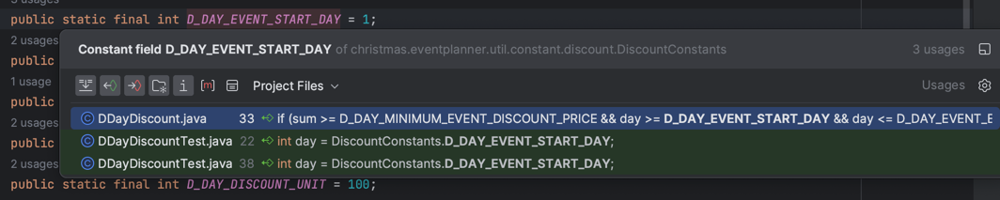

# 크리스마스 프로모션 기능 요구사항 분석

---

### 기능 개발 목록
- [x] Event Planner
- [x] Event Planner UI
- [x] Order
- [x] Discount
- [x] Badge

 
 

> discount

Discount 로직 구현 중 문제를 발견.
* 사은품을 할인으로 볼 것인지, 공짜로 제공하는 것으로 볼것인지.
* 본 내용에 대해서는 할인으로 간주해서 처리함.
* 대신 사은품으로 받는 제품에 다시 할인이 적용되지 않도록 order에 할인 가능 여부를 추가함

 

> badge

배지의 경우, 배지 인터페이스를 미리 정하고, 값을 불러오는 메서드는 toString만 사용.

 

> Formatter

Formatter 를 통해 int를 문제에서 요구하는 문자열로 변환

 
 
 

### 리팩토링
- [x] TODO로 적어놓은 버그 픽스
- [x] 상수 Enum으로 모아서 처리
- [x] 구현 Method 분리

 
 
 

### 테스트 코드

> Unit
- [x] order
- [x] badge
- [x] discount

 
 

> Integation
- [x] DecemberEventPlanner

통합테스트를 진행하는 경우, 입출력 값 지정을 미리 할 수 없어 테스트를 진행하지 못함. 따라서, Application Test 방식을 따라서, 구혀함.

 
 
 

## 추가 사항

1. 사용자 입력을 받되 명확한 에러메시지를 지정하지 않은 경우, 임의로 에러메시지를 생성했음.

 
 
 
 

## 코드 리뷰 -> 리팩토링

- [x] [준팍님 코드 리뷰](https://github.com/kukjun/java-christmas-6-kukjun/pulls)를 기반으로 리팩토링

 

> 준팍님 코드 리뷰 내용 목록
- [x] pr, readme는 상세하게 기술
- [x] 완료된 TODO 삭제
- [x] 인터페이스 네이밍이 재정의(ImplX)
- [x] 불필요한 공백 제거
- [x] 사용하지 않는 인터페이스 제거 및 재정의
- [x] toString을 디버깅을 의도로만 사용
- [x] 디미터 법칙 위반
- [x] 상수 위치에 대한 고찰 필요

 
 

#### 상수 위치에 대한 고찰

상수 위치의 경우에는 현재 모든 상수가 util -> constants에 모여있다. 이는 각각의 객체가 모두 util을 참조해야만 된다는 문제점을 가지고 있다.

Util에 넣어야하는 상수는 전역에서 사용하는 상수 값으로 한정해서 넣는게 좋은 것 같다.

그러면 각 상수들을 어떻게 관리해야 할까?

각 상수들을 살펴보니, 쓰이는 곳은 객체 내부에서 쓰이는 경우가 많고, 다른때는 테스트 할 때 쓰이는 경우가 많았다.

그러면 각 상수들 중, 중복으로 사용하는 것을 제외하고는 클래스 내부에서 생성하고 Public으로 열어주는 방법을 사용한다.

